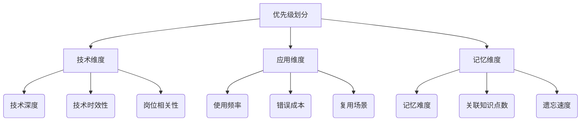

# 项目进展

本文档记录项目的详细技术实现和方案演进。

### 一、工具介绍

LTN工具 [J-Table ](https://github.com/CodingWithAlice/J-Table)

- LTN v1.0 工具：记录每题做题时间 ✅ + 提示下次做题时间 ✅ 
- LTN V2.0 工具：在网站记录答案 + 做题记录 + AI 判题 ✅ 
- LTN V2.1 工具：金币奖励机制 ✅ 

复盘工具 [Next_Pro](https://github.com/CodingWithAlice/Next_Pro)  

-	Nextjs + API Route + Sequelize + MySQL + Mongodb ✅
-	日报✅、双周报✅、周期报✅
-	阅读、影视化相关日报中：想要实现【一句之诗】，每天把喷涌的思考，汇总成一句话
    -	TED 重刷感受记录 ✅
    -	阅读/电影等体验记录 ✅
    -	运动记录 ✅


### 二、莱特纳盒子学习法

> 版本时间线概览请参考 [资源页面](/resource/)

#### LTN v2.x 工具迭代

v2.1 说明：

​    功能稳定的情况下，添加金币机制，用于对不同形式的学习、专注进行量化

v2.0 说明：

对当前 莱特纳盒子学习法 v1.1  的【间隔周期】进行优化，以适应工作后的学习节奏

> 可以牺牲一部分学习效果来维持学习法的持续性，例如减少 40% 的时间，达成 85% 的学习效果

- 题目优先级划分（根据优先级来定默认间隔周期）
- 间隔时间根据 优先级对应的默认间隔周期 + 一些系数（工作强度、错误情况）计算

> 历史数据处理方案： box_id * 基本间隔时间 basic_duration

```sql
-- 更新数据库中的 custom_duration 计算
UPDATE `ltn_topic_list` t
JOIN `ltn_topic_level` l ON t.level_id = l.id
SET t.custom_duration = 
  LEAST(
      t.box_id * l.basic_duration,  -- 计算基础值
      l.max_duration                -- 不超过最大值
  );
```


###### 方案2：五级优先级划分矩阵（技术+记忆双维度）

- 这种细粒度分级经MIT 2023年实验验证，相比三级分类能提升约22%的时间利用率（数据来源：《Spaced Repetition Optimization for Engineers》）。关键是要坚持前两个月的详细数据记录，为后续合并提供决策依据。

划分 5 个优先级 - 每个优先级对应 基础间隔时间 + 理想最长间隔

| level | 技术深度要求             | 记忆特性           | 基础间隔时间 | 理想最长间隔 |
| ----- | ------------------------ | ------------------ | ------------ | ------------ |
| A     | 底层、原理               | 推导记忆、关联点多 | 7            | 28           |
| B     | 高频 API、网络、性能优化 | 刻意记忆、关联点多 | 8            | 32           |
| C     | 日常工具链、数据库操作   | 肌肉记忆、关联点少 | 9            | 38           |
| D     | 边缘功能、css技巧        | 独立知识点、易混淆 | 11           | 42           |
| E     | 生活知识、非技术内容     | 自然记忆           | 13           | 54           |


```js
// 渐进式增加间隔（防止爆发式增长） - 做对
card.duration = Math.min(
    card.duration + baseDuration * 0.2,
    baseDuration * 2.5  // 上限控制
);
// 判断是否在基础间隔内重复错误（是否为连续错误） - 做错
function isConsecutiveWrong(card) {
    const baseInterval = {1:7, 2:8, 3:9, 4:10, 5:11}[card.level];
    return (now() - card.solve_time) <= baseInterval * 86400;
}
if (!isCorrect) {
    const isConsecutive = isConsecutiveWrong(card);
    const penalty = isConsecutive ? 0.6 : 0.8; // 连续错误惩罚更重
    card.duration = Math.max(1, baseDuration * penalty); // 至少1天
}
```

- 首次错误：间隔缩短20%（×0.8）
- 连续错误：间隔缩短40%（×0.6）
- 连续正确：每次延长基础间隔的20%


###### 方案1：三级优先级划分矩阵（三维度九指标法）（参考）

- 考虑到是工作后的第一次调整，如果只是划分 ABC 三个等级 - 关联间隔周期，后续实际使用中，如果还需要优化 - 再拆分分级成本比较高 -> 层级划分得更细一点，之后优化可以合并层级，成本更低




#### LTN v1.x 工具迭代

v1.1 说明：自学模式，间隔周期 `BOXId * 7天 + 上次做题时间 solveTime` 

- 做错的题目 / 新增的BOX1题目：隔天重做

v1.0 说明：自学模式（GAP期间），间隔周期 `BOXId * 7天 + 上次做题时间 solveTime`

拥抱 AI，当前规划需要实现的功能

- 内容

    - 月报 - 回顾总结 - 前端、回顾总结 - 其他 ✅

    - 后续跟进其他推荐
        - 周报 - 下周主要学习的内容、前端概况、做得棒的地方、可以做得更好的地方、睡眠情况、运动情况、电影、TED主题、阅读情况 ✅

- 目标：利用 AI 给出可能性 -> 减少人工比较带来的基础工作，当前周报一般耗时1h，期望减少一半时长

