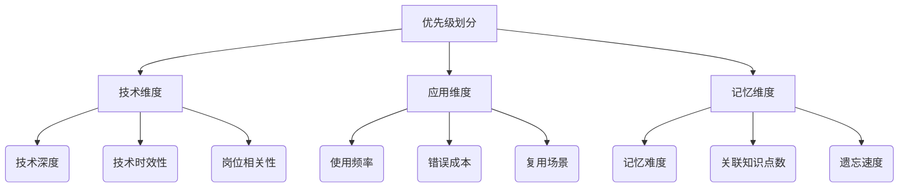

# 项目进展

#### 一、功能

LTN工具 [J-Table ](https://github.com/CodingWithAlice/J-Table)

- 规划表
- LTN v1.0 工具：记录每题做题时间 ✅ + 提示下次做题时间 ✅ 
- LTN V2.0 工具：在网站记录答案 + 做题记录 + AI 判题 ✅ 

复盘工具 [Next_Pro](https://github.com/CodingWithAlice/Next_Pro)  

-	Nextjs + API Route + Sequelize + MySQL + Mongodb ✅
-	日报✅、周报✅、月报✅、季报
-	阅读、影视化相关日报中：想要实现【一句之诗】，每天把喷涌的思考，汇总成一句话
    -	TED 重刷感受记录 ✅
    -	阅读/电影等体验记录 ✅
    -	运动记录


### 莱特纳盒子学习法 v2.x

#### 二、功能开发进展 changeLog

##### ## 2025.06.28

大虐，由于 5月加班非常严重 + 6月初阳一直在睡觉，功能进展较缓慢

- 需求4：LTN做题 Deepseek 查询 已接入 ✅
- 需求5：TED、电影/书籍 相关记录界面 已支持 ✅
- 需求6：每日做题记录、隔天错题重做 已支持 ✅

新需求：

- 需求7：月报优化，从「数据陈列」到「驱动行动」的转变
- 需求8：提供运动记录、管理的界面呈现方式，方便打卡和管理


##### ## 2025.04.20

从去年9月起的所有做题历史记录导入 mongodb


##### ## 2025.04.11-13

- 需求3：提供做题界面 + 做题时间 + 做题时长 ✅

功能梳理：前端视角需要的接口信息记录

- 点开弹窗，调用①初始化接口：判断是否展示正确答案界面 ✅
    - 不展示就停，等做题 ✅
    - 展示则将接口中查询的剩余信息展示 ✅
- 做完题，点击校验，调用校验接口：需要调用2个接口
    - ②post 接口用于存储最新一次做题答案，同时返回需要展示的数据 ✅
    - ③AI 查询当前输入的内容 和 正确答案的 错误信息分析、推论 todo 📢
- ④保存：可以填写修改 历史错误信息 + 做题时长，点击保存按钮，将数据落表 ✅ 
    - 刷新做题时间 + 模拟之前 Box 的升降功能（页面升降入口关闭）✅

```js
// 核心 两个 mongodb 表
// 正确答案记录表，唯一查询: topicId
question_answers: {
    rightAnswer: string; // 正确答案
    wrongNotes: string; // 错误记录
    topicTitle: string;
    topicId: number; // 关联 MySQL
}
// 做题记录表，唯一查询: topicId+submitTime
answer_records: {
    topicTitle: string;
  durationSec: number; // 做题时长
  submitTime: string; // 提交时间（和 mysql 中的 solveTime 对齐）
  topicId: number;
  isCorrect: boolean; // 升/降BOx
  recentAnswer: string; // 最近一次的答案
}
// 做题界面 - ③AI 校验返回的信息使用另一个接口异步返回（一般比较慢）
{
    suggesttion: [] //不落表
}
```


##### ## 2025.04.08

哭泣，找房子、搬家、加班，终于有时间把清明节安排的 LTN 优化方案实践了

- 需求2：mongodb 管理 题目答案（弹窗手动添加/修改） ✅


##### ## 2025.04.04

- 需求1：添加表 level + 给所有题目定级(借助 AI) 并更新间隔时间✅

    ```json
    // 题目答案主文档（答案唯一性）
    {
        _id: ObjectId("5f8d..."), // MongoDB自动生成
        topic_id: 123,            // 关联题目ID
        topic_title: "React Fiber架构原理", 
        right_answer: "答案",
        wrong_notes: ["❌错误1", "❌错误2"] ,
        create_at: ISODate("2025-04-01"),
        update_at: ISODate("2025-04-10")
    }
    // 做题记录子文档（独立集合）
    {
        _id: ObjectId("5f8e..."),
        topic_id: 123,             // 外键关联
        duration_ms: 45000,        // 本次耗时(毫秒)
        is_correct: false,         // 是否正确
        wrong_reason: "误解了双缓冲机制", // 错误摘要
        created_at: ISODate("2025-04-05T10:00:00"), 
    }
    ```
    
    

##### ## 2025.03.29

- 方案确定，如下 v2.0 的描述，每日复盘提供 工作模式/自学模式 的切换


#### 一、工作模式切换 - v2.0优化

##### 2025.04.04

对当前 莱特纳盒子学习法  的【间隔周期】进行优化，以适应工作后的学习节奏

> 可以牺牲一部分学习效果来维持学习法的持续性，例如减少 40% 的时间，达成 85% 的学习效果

- 题目优先级划分（根据优先级来定默认间隔周期）
- 间隔时间根据 优先级对应的默认间隔周期 + 一些系数（工作强度、错误情况）计算

> 历史数据处理方案： box_id * 基本间隔时间 basic_duration

```sql
-- 更新数据库中的 custom_duration 计算
UPDATE `ltn_topic_list` t
JOIN `ltn_topic_level` l ON t.level_id = l.id
SET t.custom_duration = 
  LEAST(
      t.box_id * l.basic_duration,  -- 计算基础值
      l.max_duration                -- 不超过最大值
  );
```


###### 方案2：五级优先级划分矩阵（技术+记忆双维度）

- 这种细粒度分级经MIT 2023年实验验证，相比三级分类能提升约22%的时间利用率（数据来源：《Spaced Repetition Optimization for Engineers》）。关键是要坚持前两个月的详细数据记录，为后续合并提供决策依据。

划分 5 个优先级 - 每个优先级对应 基础间隔时间 + 理想最长间隔

| level | 技术深度要求             | 记忆特性           | 基础间隔时间 | 理想最长间隔 |
| ----- | ------------------------ | ------------------ | ------------ | ------------ |
| A     | 底层、原理               | 推导记忆、关联点多 | 7            | 28           |
| B     | 高频 API、网络、性能优化 | 刻意记忆、关联点多 | 8            | 32           |
| C     | 日常工具链、数据库操作   | 肌肉记忆、关联点少 | 9            | 38           |
| D     | 边缘功能、css技巧        | 独立知识点、易混淆 | 11           | 42           |
| E     | 生活知识、非技术内容     | 自然记忆           | 13           | 54           |


```js
// 渐进式增加间隔（防止爆发式增长） - 做对
card.duration = Math.min(
    card.duration + baseDuration * 0.2,
    baseDuration * 2.5  // 上限控制
);
// 判断是否在基础间隔内重复错误（是否为连续错误） - 做错
function isConsecutiveWrong(card) {
    const baseInterval = {1:7, 2:8, 3:9, 4:10, 5:11}[card.level];
    return (now() - card.solve_time) <= baseInterval * 86400;
}
if (!isCorrect) {
    const isConsecutive = isConsecutiveWrong(card);
    const penalty = isConsecutive ? 0.6 : 0.8; // 连续错误惩罚更重
    card.duration = Math.max(1, baseDuration * penalty); // 至少1天
}
```

- 首次错误：间隔缩短20%（×0.8）
- 连续错误：间隔缩短40%（×0.6）
- 连续正确：每次延长基础间隔的20%


###### 方案1：三级优先级划分矩阵（三维度九指标法）（参考）

- 考虑到是工作后的第一次调整，如果只是划分 ABC 三个等级 - 关联间隔周期，后续实际使用中，如果还需要优化 - 再拆分分级成本比较高 -> 层级划分得更细一点，之后优化可以合并层级，成本更低




### 莱特纳盒子学习法 v1.x

v1.1 说明：自学模式，间隔周期 `BOXId * 7天 + 上次做题时间 solveTime` 

- 做错的题目 / 新增的BOX1题目：隔天重做

v1.0 说明：自学模式（GAP期间），间隔周期 `BOXId * 7天 + 上次做题时间 solveTime`

#### 一、AI ✅

拥抱 AI，当前规划需要实现的功能

- 内容

    - 月报 - 回顾总结 - 前端、回顾总结 - 其他 ✅

    - 后续跟进其他推荐
        - 周报 - 下周主要学习的内容、前端概况、做得棒的地方、可以做得更好的地方、睡眠情况、运动情况、电影、TED主题、阅读情况 ✅

- 目标：利用 AI 给出可能性 -> 减少人工比较带来的基础工作，当前周报一般耗时1h，期望减少一半时长

#### 二、AI changeLog

> 以下为 集成 deepseek 接入网站过程记录

##### 2025.03.04

- 将服务器 docker 数据迁移到数据盘
    - 首先要停止 Docker 服务，然后将`/var/lib/docker`目录下的数据备份并迁移到数据盘的合适位置。接着修改 Docker 的配置文件，一般在`/etc/docker/daemon.json`中添加或修改`"data-root": "/test"`，指定新的数据目录。最后启动 Docker 服务，检查是否正常运行，并且数据是否正确存储在新的位置
- J-Table 添加权限校验 - 守卫
- nginx 配置处理 `http://codingwithalice.top:4001`


##### 2025.03.02

- Next_pro 的所有后端接口，添加权限校验 - 全局中间件

##### 2025.03.01

- Next_pro 的 `DEEPSEEK_API_KEY` 存储在服务器 config.env 中统一管理
- Next_pro 的 deepseek 的 AI 提示语存储在 config.env 中

##### 2025.02.28

- Next_Pro 调通本地的 AI 调用提示 月报总结信息


#### 三、功能 changeLog

> 以下为 2025.1.15 - 2025.2.26 记录的复盘工具、LTN工具开发、部署上线过程

##### 2025.1.15 进展

Next_Pro 日报落表 - 时间周期落表


##### 2025.1.17 进展

J-Table 后端接口需求梳理：

```js
表
CREATE TABLE `ltn_data` (
  `id` BIGINT NOT NULL AUTO_INCREMENT,
  `title` varchar(255) NOT NULL COMMENT '题目标题',
  `source` BIGINT NOT NULL COMMENT '题目来源作业/博客',
  `box_id` BIGINT NOT NULL COMMENT '归属box',
  `solve_time` TIME NOT NULL COMMENT '做题时间',
  `created_at` datetime NOT NULL,
  `updated_at` datetime NOT NULL,
  PRIMARY KEY (`id`)
) 
接口：
1、查询接口 /findAll 按 box_id 分组
2、某题操作按钮 /operate 参数：id + type:upgrade[box_id+1]/degrade[box_id降为1]
3、过滤接口 /filter 参数：startTime + endTime[solve_time+box_id*7∈[start,end]]
建议 startTime: now endTime: now+10天(一个周期)
```


##### 2025.1.18 进展

- J-Table 后端服务使用 nestjs 初始化

- 快速打通数据库，提供查询接口


##### 2025.1.20 进展

LTN工具未来迭代方向：结合记忆曲线，在遗忘曲线的周期内，对知识进行回顾

J-Table

- 前端路由 + 莱特纳盒子
- /ltn 查询接口，按 boxId 分组返回 + 前端侧按盒子分组展示
- /ltn/operate 修改接口，升/降LTN内容 + 前端侧提供按钮
- 提供过滤接口，生成当前周期的 LTN 题库

##### 2025.1.21 进展

Next_Pro

-	日报 事项记录 前后端+数据库

##### 2025.1.22 进展

- 买域名 codingwithalice.top + 买 轻量应用服务器(4个月，得到 ICP 备案资格，并提交备案)

- 两个项目分工：一个专门梳理 LTN 盒子；一个记录生活


##### 2025.1.23 进展

- J-Table：展示周期 + 切换LTN/all 展示

##### 2025.1.25 进展

- 清理博客和印象笔记中的「LTN题目」管理Tag 和列表
- J-Table：新增添加 Box 弹窗 + 统一管理所有题目和周期

##### 2025.1.26

- Next_Pro 每日数据 接口+展示

##### 2025.1.27

- Next_Pro 周报 查询 + 落表 + 展示

##### 2025.2.2  进展

部署至云端数据库（服务器默认安装了 Docker 环境 - 提供了容器化的部署方式

```js
// check docker 安装
docker --version // Docker version 26.1.3, build b72abbb
```

##### 2025.2.10  进展

- Next_Pro 周报 数据源 modal+页面展示，并投入使用写 LTN15周报

##### 2025.2.12 进展

- Next_Pro 月报
- Next_Pro 初始化部署

部署指令操作：

1、更新 Next_Pro 代码

- https://gitee.com/CodingWithAlice/Next_Pro 更新
- 方便国内 git pull 拉取

2、在 Next_Pro 目录构建：

```
sudo docker build -t next_pro .
```

- 本地 npm run build 确认没有问题
- => => writing image sha256:32f2351a67a8c4704e94e42177f64cdb1e16aa7d1e9eb4bb2c59c3d8ac2c3440
   => => naming to docker.io/library/next_pro 212.7s

3、启动服务：

```js
sudo docker run -d -p 3000:3000 next_pro
```

- 查看运行中的容器 

   ```js
   sudo docker ps
   ```

   如果 找到对应 IMAGES + STATUS为 up 即成功

- 查看容器日志 sudo docker logs next_pro 获取日志

- 检查端口占用情况 sudo netstat -tuln | grep :3000 检查主机的 3000 端口是否被监听
  (启动后， 在防火墙配置开放该端口  3000  的入站规则)

访问链接：

http://121.43.164.209:3000

http://codingwithalice.top:3000/

##### 2025.2.13 进展

- Next_Pro 在服务器部署 mysql，修改代码根据环境适配

##### 2025.2.14 进展

- Next_Pro 修改手机端样式

##### 2025.2.17 进展

-	Next_Pro 添加二次阅读工具页面

##### 2025.2.18 进展

- J-Table 也部署到线上

##### 2025.2.26 进展

配置 nginx ，方便不携带端口访问 - 在 NextJS 项目中添加 nginx 配置

- http://codingwithalice.top/ 可以直接访问

```js
// 使用 docker-compose
sudo docker pull nginx // 安装 nginx
```

